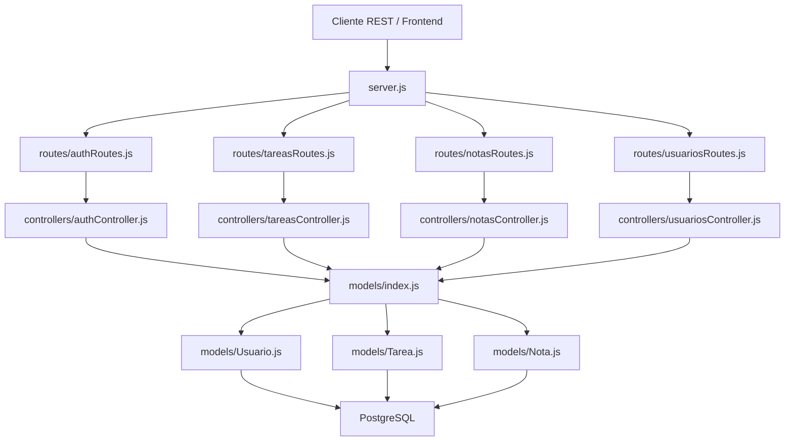
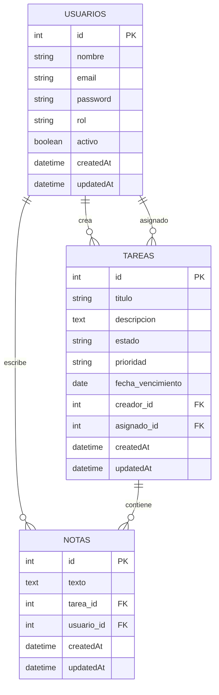

# Gestor de Tareas - Backend

Backend API REST para un gestor de tareas colaborativo con roles de usuario y administrador, autenticacion JWT, tareas asignables y notas separadas por tarea.

## Tecnologias

- Node.js
- Express
- PostgreSQL
- Sequelize
- JWT
- bcryptjs
- CORS
- Morgan

## Instalacion

```bash
npm install
```

Configura el archivo `.env`:

```env
PORT=3000
NODE_ENV=development

DB_HOST=localhost
DB_PORT=5432
DB_NAME=gestor_tareas
DB_USER=postgres
DB_PASSWORD=tu_password

JWT_SECRET=tu_clave_secreta
JWT_EXPIRES_IN=24h

FRONTEND_URL=http://localhost:5500
```

## Ejecucion

Modo desarrollo:

```bash
npm run dev
```

Modo normal:

```bash
npm start
```

API base:

```text
http://localhost:3000
```

## Roles

### Administrador

Puede:

- Crear tareas.
- Asignar tareas a usuarios.
- Editar contenido de tareas.
- Cambiar el estado de cualquier tarea.
- Eliminar tareas.
- Crear notas en cualquier tarea.
- Editar o eliminar cualquier nota.
- Listar usuarios.
- Desactivar usuarios.

### Usuario

Puede:

- Ver tareas publicas.
- Ver notas publicas.
- Ver sus tareas asignadas.
- Cambiar el estado de una tarea asignada.
- Crear notas en una tarea asignada.
- Editar o eliminar sus propias notas.

No puede:

- Crear tareas.
- Asignar tareas.
- Editar titulo, descripcion, prioridad, fecha de vencimiento o asignacion.
- Editar o eliminar notas de otros usuarios.

## Reglas de Tareas

Estados permitidos:

```text
pendiente
en_progreso
revision
completada
cancelada
```

Prioridades permitidas:

```text
baja
media
alta
urgente
```

Las notas no se guardan dentro de la tabla `tareas`. Las notas tienen su propia tabla y se gestionan con `/api/notas`.

## Endpoints

### Auth

```http
POST /api/auth/registro
POST /api/auth/login
GET  /api/auth/perfil
```

### Tareas

```http
GET    /api/tareas
GET    /api/tareas/:id
GET    /api/tareas/usuario/mis-tareas
POST   /api/tareas
PUT    /api/tareas/:id
DELETE /api/tareas/:id
```

Permisos:

- `GET /api/tareas` y `GET /api/tareas/:id` son publicos.
- `POST /api/tareas` requiere administrador.
- `PUT /api/tareas/:id`:
  - administrador puede editar contenido, asignacion y estado.
  - usuario asignado solo puede cambiar estado.
- `DELETE /api/tareas/:id` requiere administrador.

### Notas

```http
GET    /api/notas/tarea/:tareaId
GET    /api/notas/:id
POST   /api/notas/tarea/:tareaId
PUT    /api/notas/:id
DELETE /api/notas/:id
```

Permisos:

- `GET /api/notas/tarea/:tareaId` es publico.
- `GET /api/notas/:id` es publico.
- `POST /api/notas/tarea/:tareaId`:
  - administrador puede crear nota en cualquier tarea.
  - usuario puede crear nota si la tarea esta asignada a el.
- `PUT /api/notas/:id`:
  - autor de la nota puede editar su propia nota.
  - administrador puede editar cualquier nota.
- `DELETE /api/notas/:id`:
  - autor de la nota puede eliminar su propia nota.
  - administrador puede eliminar cualquier nota.

### Usuarios

```http
GET    /api/usuarios
GET    /api/usuarios/:id
PUT    /api/usuarios/:id
DELETE /api/usuarios/:id
```

Permisos:

- `GET /api/usuarios` requiere administrador.
- `GET /api/usuarios/:id` permite administrador o el mismo usuario.
- `PUT /api/usuarios/:id` permite administrador o el mismo usuario.
- `DELETE /api/usuarios/:id` requiere administrador.

## Archivos REST

El proyecto incluye archivos `.rest` separados por contexto:

```text
api.rest
usuario.rest
admin.rest
tareas-notas-publicas.rest
```

Uso recomendado:

- `api.rest`: indice y health checks basicos.
- `usuario.rest`: pruebas como usuario normal.
- `admin.rest`: pruebas como administrador.
- `tareas-notas-publicas.rest`: consultas publicas sin token.

## Flujo recomendado de prueba

1. Ejecutar `Login usuario` en `usuario.rest`.
2. Ejecutar `Perfil usuario` y copiar el `id` a `@usuarioId`.
3. Ejecutar `Login administrador` en `admin.rest`.
4. En `admin.rest`, crear una tarea asignada a `@usuarioId`.
5. Copiar el ID de la tarea creada a `@tareaId` en `usuario.rest`.
6. En `usuario.rest`, cambiar el estado de la tarea.
7. En `usuario.rest`, crear una nota para esa tarea.
8. En `tareas-notas-publicas.rest`, consultar la tarea y sus notas sin token.

## Diagrama de Estructura



## Diagrama de Relaciones



## Estructura de Carpetas

```text
backend/
  config/
    database.js
  controllers/
    authController.js
    notasController.js
    tareasController.js
    usuariosController.js
  middlewares/
    autenticacion.js
    validaciones.js
  models/
    index.js
    Nota.js
    Tarea.js
    Usuario.js
  routes/
    authRoutes.js
    notasRoutes.js
    tareasRoutes.js
    usuariosRoutes.js
  admin.rest
  api.rest
  database.sql
  package.json
  server.js
  tareas-notas-publicas.rest
  usuario.rest
```

## Notas para Frontend

### Tareas

Para cambiar estado:

```http
PUT /api/tareas/:id
Authorization: Bearer TOKEN
Content-Type: application/json
```

```json
{
  "estado": "revision"
}
```

Para editar contenido como admin:

```json
{
  "titulo": "Nuevo titulo",
  "descripcion": "Nueva descripcion",
  "prioridad": "alta",
  "fecha_vencimiento": "2026-07-05",
  "asignado_id": 2
}
```

### Notas

Para crear una nota:

```http
POST /api/notas/tarea/:tareaId
Authorization: Bearer TOKEN
Content-Type: application/json
```

```json
{
  "texto": "Surgio un imprevisto."
}
```

Para listar notas de una tarea:

```http
GET /api/notas/tarea/:tareaId
```

Para editar una nota propia:

```http
PUT /api/notas/:id
Authorization: Bearer TOKEN
Content-Type: application/json
```

```json
{
  "texto": "Nota editada."
}
```

Para eliminar una nota propia:

```http
DELETE /api/notas/:id
Authorization: Bearer TOKEN
```

### Importante

No enviar notas dentro de `PUT /api/tareas/:id`.

Incorrecto:

```json
{
  "estado": "revision",
  "notas": "Texto de nota"
}
```

Correcto:

```json
{
  "estado": "revision"
}
```

Y luego:

```json
{
  "texto": "Texto de nota"
}
```
