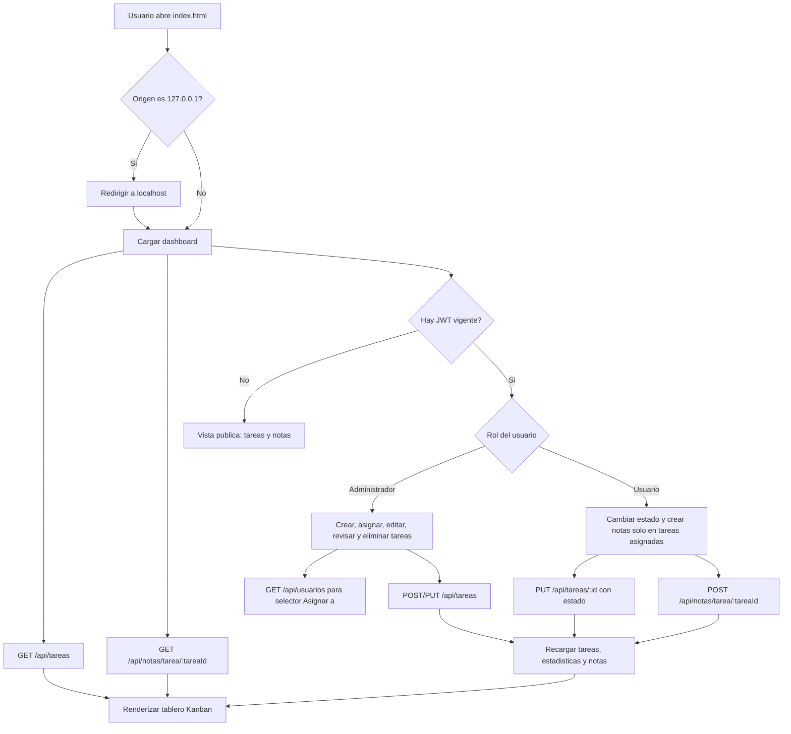
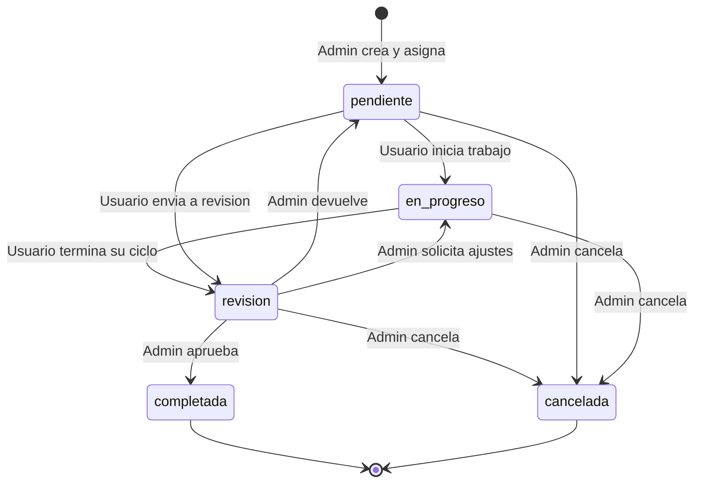
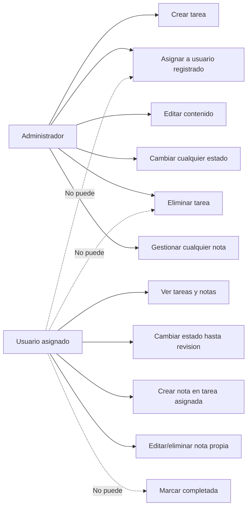
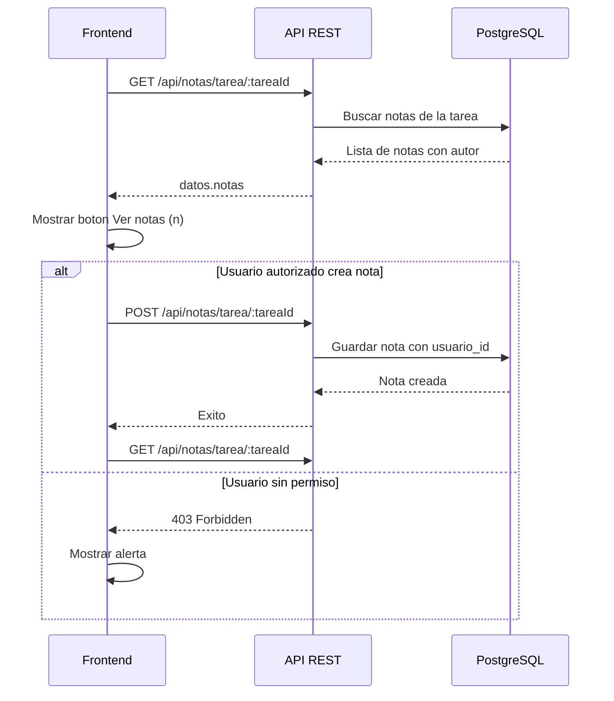
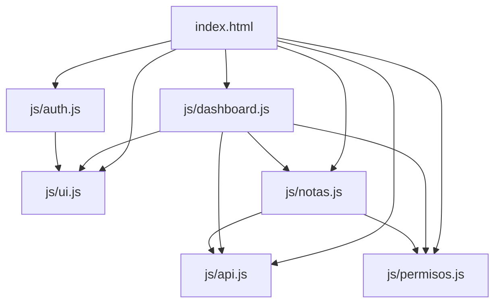

# Diagrama de Flujo - Gestor de Tareas

Este archivo describe el flujo principal del frontend y el ciclo de vida de una tarea.

## Flujo general de uso

## Ciclo de vida de una tarea

## Permisos por rol

## Flujo de notas

## Modulos frontend

